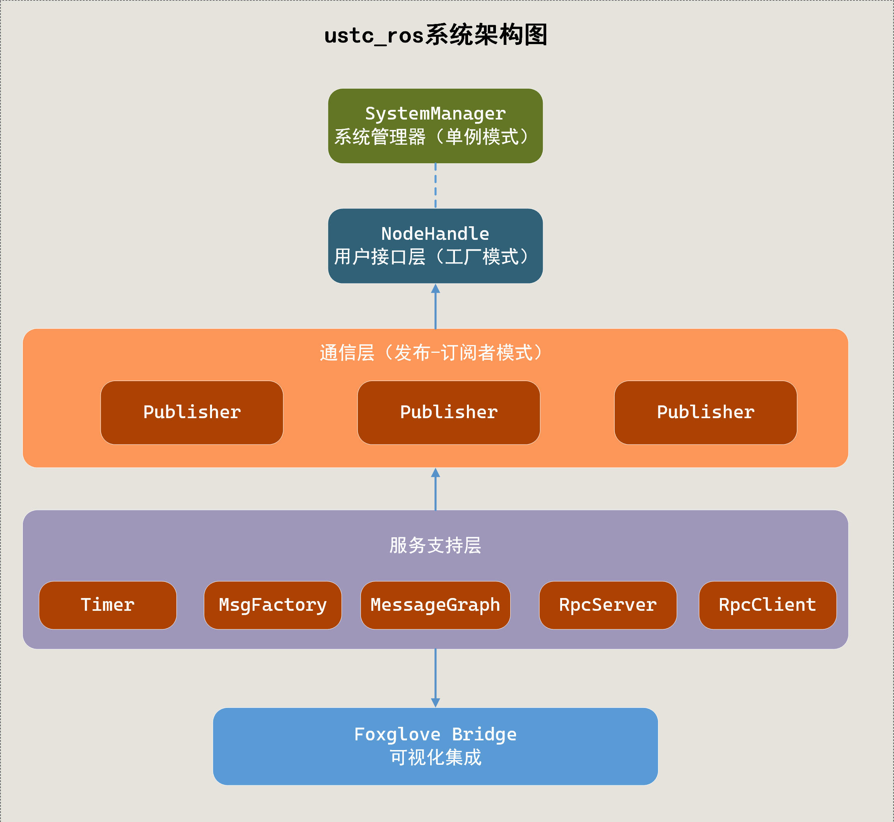

# 核心模块设计

## 1. 系统架构概述

simple_ros系统采用了基于发布-订阅模式的分布式架构，主要由以下核心模块组成：

- **SystemManager**：系统管理器，负责初始化、运行和关闭整个系统
- **NodeHandle**：节点句柄，提供用户与系统交互的主要接口
- **Publisher/Subscriber**：发布者和订阅者，实现消息的发布和订阅功能
- **Timer**：定时器，提供定时触发功能
- **MessageQueue**：消息队列，负责消息的存储和分发
- **Foxglove Bridge**：可视化桥接器，提供与Foxglove Studio的集成功能

这些模块相互协作，共同构成了一个完整的机器人操作系统框架。



## 2. SystemManager模块

SystemManager是整个系统的核心组件，采用单例模式设计，负责管理系统的生命周期和各个组件。

### 2.1 设计思路

SystemManager的设计目标是提供一个统一的入口点，管理系统的初始化、运行和关闭过程，协调各个组件之间的交互。

### 2.2 核心功能

- **系统初始化**：初始化网络、消息队列、RPC客户端等组件
- **节点管理**：管理节点信息，包括节点名称、端口等
- **消息循环**：提供spin()和spinOnce()方法，处理消息队列中的消息
- **资源管理**：负责系统资源的分配和释放
- **关闭系统**：优雅地关闭系统，释放所有资源

### 2.3 类结构

```cpp
class SystemManager {
public:
    // 获取单例实例
    static SystemManager& instance();

    // 初始化方法（多个重载版本）
    void init();
    void init(int port);
    void init(int port, std::string node_name);
    void init(const std::string& node_name);

    // 消息循环方法
    void spin();
    void spinOnce();

    // 关闭系统
    void shutdown();

    // 获取系统组件
    std::shared_ptr<MessageQueue> getMessageQueue() const;
    std::shared_ptr<PollManager> getPollManager() const;
    std::shared_ptr<muduo::net::EventLoop> getEventLoop() const;
    std::shared_ptr<RosRpcClient> getRpcClient() const;
    NodeInfo getNodeInfo() const;

    // 获取当前时间
    muduo::Timestamp now() const;

private:
    // 私有构造函数
    SystemManager();
    ~SystemManager();

    // 禁止拷贝和赋值
    SystemManager(const SystemManager&) = delete;
    SystemManager& operator=(const SystemManager&) = delete;

    // 私有成员变量
    std::shared_ptr<MessageQueue> message_queue_;
    std::shared_ptr<PollManager> poll_manager_;
    std::shared_ptr<muduo::net::EventLoop> event_loop_;
    std::shared_ptr<RosRpcClient> rpc_client_;
    NodeInfo node_info_;
    std::atomic<bool> running_;
};
```

### 2.4 实现原理

SystemManager使用了以下关键技术和设计模式：

- **单例模式**：确保系统中只有一个SystemManager实例
- **Muduo网络库**：提供高性能的网络IO和事件驱动机制
- **智能指针**：管理对象的生命周期，避免内存泄漏
- **线程安全**：使用互斥锁和原子操作确保线程安全
- **事件循环**：基于Reactor模式的事件驱动机制

## 3. NodeHandle模块

NodeHandle是用户与系统交互的主要接口，提供创建发布者、订阅者和定时器的功能。

### 3.1 设计思路

NodeHandle的设计目标是提供一个简洁、易用的接口，隐藏系统内部的复杂性，使用户能够方便地创建和管理发布者、订阅者和定时器。

### 3.2 核心功能

- **创建发布者**：通过advertise方法创建各种类型的发布者
- **创建订阅者**：通过subscribe方法创建各种类型的订阅者
- **创建定时器**：通过createTimer方法创建定时器

### 3.3 类结构

```cpp
class NodeHandle {
public:
    // 构造函数和析构函数
    NodeHandle();
    ~NodeHandle();

    // 禁止拷贝，允许移动
    NodeHandle(const NodeHandle&) = delete;
    NodeHandle& operator=(const NodeHandle&) = delete;
    NodeHandle(NodeHandle&&) noexcept;
    NodeHandle& operator=(NodeHandle&&) noexcept;

    // 创建发布者
    template<typename MsgType>
    std::shared_ptr<Publisher<MsgType>> advertise(const std::string& topic);

    // 创建订阅者（函数对象版本）
    template<typename MsgType>
    std::shared_ptr<Subscriber> subscribe(
        const std::string& topic,
        uint32_t queue_size,
        std::function<void(const std::shared_ptr<MsgType>&)> callback);

    // 创建订阅者（类成员函数版本）
    template<typename MsgType, typename Class>
    std::shared_ptr<Subscriber> subscribe(
        const std::string& topic,
        uint32_t queue_size,
        void(Class::*callback)(const std::shared_ptr<MsgType>&),
        Class* instance);

    // 创建订阅者（非模板版本）
    std::shared_ptr<Subscriber> subscribe(
        const std::string& topic,
        uint32_t queue_size,
        const std::string& msg_type_name,
        MessageQueue::Callback callback);

    // 创建定时器
    std::shared_ptr<Timer> createTimer(
        double period,
        const TimerCallback& callback,
        bool oneshot = false);

private:
    NodeInfo node_info_;
};
```

### 3.4 实现原理

NodeHandle使用了以下关键技术和设计模式：

- **模板编程**：提供类型安全的接口，支持各种消息类型
- **函数对象**：支持lambda表达式和函数指针作为回调函数
- **智能指针**：管理发布者、订阅者和定时器的生命周期
- **移动语义**：支持资源的高效转移

## 4. Publisher/Subscriber模块

Publisher和Subscriber是系统中的两个核心组件，负责实现发布-订阅通信模式。

### 4.1 设计思路

Publisher和Subscriber的设计目标是提供一个高效、可靠的消息传递机制，支持不同节点之间的通信。

### 4.2 Publisher类

#### 4.2.1 核心功能

- **发布消息**：将消息发布到指定的主题
- **取消注册**：取消发布者的注册，不再发布消息

#### 4.2.2 类结构

```cpp
template<typename MsgType>
class Publisher {
public:
    Publisher(const std::string& topic);
    ~Publisher();

    // 禁止拷贝
    Publisher(const Publisher&) = delete;
    Publisher& operator=(const Publisher&) = delete;

    // 发布消息
    void publish(const MsgType& msg);

    // 取消注册
    void unregister();

private:
    std::string topic_;
    std::shared_ptr<muduo::net::TcpClient> client_;
};
```

### 4.3 Subscriber类

#### 4.3.1 核心功能

- **订阅主题**：订阅指定主题的消息
- **自动取消订阅**：当订阅者对象被销毁时，自动取消订阅

#### 4.3.2 类结构

```cpp
class Subscriber {
public:
    // 构造函数（类型安全模板版本）
    template<typename MsgType>
    Subscriber(
        const std::string& topic,
        uint32_t queue_size,
        std::function<void(const std::shared_ptr<MsgType>&)> callback);

    // 析构函数（自动取消订阅）
    ~Subscriber();

    // 禁止拷贝
    Subscriber(const Subscriber&) = delete;
    Subscriber& operator=(const Subscriber&) = delete;

private:
    std::string topic_;
    uint32_t queue_size_;
    MessageQueue::Callback callback_;
};
```

### 4.4 实现原理

Publisher和Subscriber使用了以下关键技术和设计模式：

- **Protobuf**：使用Protocol Buffers进行消息序列化和反序列化
- **Muduo网络库**：提供高性能的网络通信
- **RAII**：使用资源获取即初始化的原则，确保资源的正确管理
- **回调机制**：使用回调函数处理接收到的消息

## 5. Timer模块

Timer模块提供定时触发功能，允许用户以指定的周期执行回调函数。

### 5.1 设计思路

Timer的设计目标是提供一个高精度、可靠的定时器功能，支持周期性和一次性触发模式。

### 5.2 核心功能

- **启动定时器**：开始定时触发
- **停止定时器**：停止定时触发
- **暂停/恢复定时器**：临时暂停和恢复定时触发
- **设置触发周期**：调整定时器的触发周期
- **设置一次性模式**：设置定时器为一次性触发模式

### 5.3 类结构

```cpp
struct TimerEvent {
    muduo::Timestamp current_real;
    muduo::Timestamp last_real;
};

typedef std::function<void(const TimerEvent&)> TimerCallback;

class Timer {
public:
    Timer(
        double period,
        const TimerCallback& callback,
        bool oneshot = false);
    ~Timer();

    // 禁止拷贝
    Timer(const Timer&) = delete;
    Timer& operator=(const Timer&) = delete;

    // 控制方法
    void start();
    void stop();
    void pause();
    void resume();

    // 设置属性
    void setOneShot(bool oneshot);
    double getPeriod() const;
    void setPeriod(double period);

private:
    void onTimer(const muduo::Timestamp& now);

    double period_;
    TimerCallback callback_;
    bool oneshot_;
    bool running_;
    bool paused_;
    muduo::net::TimerId timer_id_;
    muduo::Timestamp last_trigger_time_;
};
```

### 5.4 实现原理

Timer模块使用了以下关键技术和设计模式：

- **Muduo定时器**：基于Muduo库的定时器机制实现高精度定时
- **回调机制**：使用回调函数处理定时器触发事件
- **状态管理**：维护定时器的运行状态（运行、停止、暂停）

## 6. MessageQueue模块

MessageQueue模块负责消息的存储和分发，是系统中消息传递的核心组件。

### 6.1 设计思路

MessageQueue的设计目标是提供一个高效、线程安全的消息存储和分发机制，支持不同节点之间的通信。

### 6.2 核心功能

- **注册主题**：注册新的消息主题
- **添加订阅者**：为指定主题添加订阅者
- **移除订阅者**：移除指定主题的订阅者
- **推送消息**：将消息推送到指定主题的队列
- **处理回调**：处理消息队列中的消息，调用相应的回调函数
- **设置队列大小**：设置指定主题的消息队列大小

### 6.3 类结构

```cpp
class MessageQueue {
public:
    typedef std::function<void(std::shared_ptr<google::protobuf::Message>)> Callback;

    MessageQueue();
    ~MessageQueue();

    // 禁止拷贝
    MessageQueue(const MessageQueue&) = delete;
    MessageQueue& operator=(const MessageQueue&) = delete;

    // 主题管理
    void registerTopic(const std::string& topic);
    void setTopicMaxQueueSize(const std::string& topic, uint32_t max_size);

    // 订阅者管理
    void addSubscriber(const std::string& topic, Callback cb);
    void removeSubscriber(const std::string& topic);

    // 消息处理
    void push(const std::string& topic, std::shared_ptr<google::protobuf::Message> msg);
    void processCallbacks();

private:
    // 私有成员
    const uint32_t default_max_queue_size_ = 100;
    std::unordered_set<std::string> registered_topics_;
    std::unordered_map<std::string, uint32_t> topic_max_queue_sizes_;
    std::unordered_map<std::string, std::queue<std::shared_ptr<google::protobuf::Message>>> message_queues_;
    std::unordered_map<std::string, std::vector<Callback>> subscribers_;
    std::mutex mutex_;
};
```

### 6.4 实现原理

MessageQueue模块使用了以下关键技术和设计模式：

- **线程安全**：使用互斥锁保证多线程环境下的安全访问
- **队列**：使用队列存储消息，支持先进先出的消息处理顺序
- **回调机制**：使用回调函数分发消息
- **哈希表**：使用哈希表快速查找主题和订阅者

## 7. Foxglove Bridge模块

Foxglove Bridge模块提供与Foxglove Studio的集成功能，允许用户以图形化方式查看和分析机器人系统的数据。

### 7.1 设计思路

Foxglove Bridge的设计目标是提供一个桥接器，将simple_ros系统中的数据转发到Foxglove Studio进行可视化展示。

### 7.2 核心功能

- **WebSocket服务**：提供WebSocket服务，供Foxglove Studio连接
- **数据转发**：将系统中的消息转发到Foxglove Studio
- **支持多种数据类型**：支持发布各种类型的可视化数据

### 7.3 实现原理

Foxglove Bridge模块使用了以下关键技术和设计模式：

- **WebSocket**：使用WebSocket协议与Foxglove Studio通信
- **JSON-RPC**：使用JSON-RPC协议进行远程过程调用
- **消息转换**：将系统中的Protobuf消息转换为Foxglove Studio支持的格式

## 8. 通信机制

simple_ros系统使用基于主题的发布-订阅通信机制，支持不同节点之间的消息传递。

### 8.1 发布-订阅模式

发布-订阅模式是一种消息传递模式，其中发布者发布消息，订阅者接收消息，发布者和订阅者之间通过主题进行解耦。

### 8.2 消息格式

系统使用Protocol Buffers作为消息序列化格式，支持高效的数据序列化和反序列化。

### 8.3 网络通信

系统使用TCP协议进行网络通信，基于Muduo网络库实现高性能的网络IO。

### 8.4 多线程处理

系统使用多线程处理消息，包括网络IO线程、消息处理线程等，提高系统的并发处理能力。

## 9. 设计模式应用

simple_ros系统中应用了多种设计模式，包括：

### 9.1 单例模式

- **应用场景**：SystemManager的实现
- **目的**：确保系统中只有一个SystemManager实例，方便全局访问

### 9.2 发布-订阅模式

- **应用场景**：Publisher和Subscriber的实现
- **目的**：实现组件之间的解耦，提高系统的灵活性和可扩展性

### 9.3 观察者模式

- **应用场景**：MessageQueue的实现
- **目的**：实现消息的分发，当有新消息到达时通知所有订阅者

### 9.4 工厂模式

- **应用场景**：NodeHandle创建Publisher和Subscriber，以及MsgFactory创建消息实例
- **目的**：隐藏对象创建的细节，提供统一的创建接口

### 9.5 RAII模式

- **应用场景**：资源管理（如文件、网络连接等）
- **目的**：确保资源的正确获取和释放，避免资源泄漏

## 10. 节点图管理机制

### 10.1 概述

simple_ros系统通过MessageGraph模块维护了一个完整的节点图，用于快速获取订阅发布关系，提高系统通信效率。该模块实现了节点、主题和发布者-订阅者关系的管理，支持高效的消息路由和拓扑查询。

### 10.2 核心数据结构

MessageGraph模块的核心数据结构包括：

```cpp
// 主题键，包含主题名称和消息类型
struct TopicKey {
    std::string topic;
    std::string msg_type;
};

// 边，表示从发布节点到订阅节点的连接
struct Edge {
    std::string src_node;  // 源节点（发布者）
    std::string dst_node;  // 目标节点（订阅者）
    TopicKey key;          // 主题键
};

// 节点数据结构，存储节点信息和发布/订阅关系
struct NodeData {
    NodeInfo info;                         // 节点基本信息（名称、IP、端口）
    std::set<TopicKey> publishes;          // 节点发布的主题集合
    std::set<TopicKey> subscribes;         // 节点订阅的主题集合
};
```

### 10.3 主要功能

MessageGraph提供了以下核心功能：

1. **节点管理**：添加、更新和删除节点信息
2. **发布者管理**：注册和注销节点的发布主题
3. **订阅者管理**：注册和注销节点的订阅主题
4. **连接管理**：自动建立和断开发布者与订阅者之间的连接
5. **高效查询**：快速获取特定主题的发布者列表或订阅者列表
6. **可视化支持**：提供ToReadableString()、ToDOT()和ToJSON()方法，支持将节点图导出为可读文本、DOT图或JSON格式

### 10.4 关键实现机制

MessageGraph通过以下数据结构和算法实现高效的节点关系管理：

```cpp
// 存储所有节点
std::unordered_map<std::string, NodeData> nodes_;

// 存储所有边（发布者到订阅者的连接）
std::unordered_set<Edge> edges_;

// 按主题分组的发布者和订阅者，加速查询
std::unordered_map<TopicKey, std::unordered_set<std::string>> publishers_by_topic_;
std::unordered_map<TopicKey, std::unordered_set<std::string>> subscribers_by_topic_;
```

当添加发布者或订阅者时，系统会自动建立相应的连接（边），并在注销时自动清理不再需要的连接和孤立节点，保持图的简洁和高效。

## 11. 消息工厂设计

### 11.1 设计思路

MsgFactory（消息工厂）模块采用单例模式设计，提供了一个统一的接口来创建和管理Protocol Buffers消息实例。它解决了动态创建不同类型消息的问题，并通过缓存机制提高了消息创建的效率。

### 11.2 核心实现

MsgFactory的核心实现如下：

```cpp
class MsgFactory {
public:
    // 获取单例
    static MsgFactory& instance();

    // 注册消息类型
    template<typename MsgType>
    void registerMessage() {
        factory_[MsgType::descriptor()->full_name()] = &MsgType::default_instance();
    }

    // 创建消息实例
    std::unique_ptr<google::protobuf::Message> createMessage(const std::string& name);

    // 将unique_ptr转换为shared_ptr
    std::shared_ptr<google::protobuf::Message> makeSharedMessage(std::unique_ptr<google::protobuf::Message> msg);

private:
    MsgFactory() = default;
    ~MsgFactory() = default;

    // 禁止拷贝
    MsgFactory(const MsgFactory&) = delete;
    MsgFactory& operator=(const MsgFactory&) = delete;

    // 缓存消息原型
    std::unordered_map<std::string, const google::protobuf::Message*> factory_;
    google::protobuf::DynamicMessageFactory dynamic_factory_;
};
```

### 11.3 工作流程

MsgFactory的消息创建流程如下：

1. **消息注册**：用户通过`registerMessage<T>()`模板方法注册消息类型
2. **消息创建**：当调用`createMessage(name)`时，首先检查缓存中是否存在对应类型
3. **缓存命中**：如果缓存命中，直接使用缓存的消息原型创建新实例
4. **动态创建**：如果缓存未命中，尝试通过DescriptorPool动态查找和创建消息类型
5. **缓存更新**：将动态创建的消息类型缓存起来，供后续使用

### 11.4 使用示例

```cpp
// 注册消息类型
MsgFactory::instance().registerMessage<example::SensorData>();

// 创建消息实例
auto sensor_msg = MsgFactory::instance().createMessage("example.SensorData");

// 序列化和解析消息
std::string data;
sensor_msg->SerializeToString(&data);

// 创建新消息并解析
auto new_msg = MsgFactory::instance().createMessage("example.SensorData");
new_msg->ParseFromString(data);
```

## 12. ROS Master RPC设计

### 12.1 概述

simple_ros系统的Master节点通过gRPC框架提供远程过程调用（RPC）服务，实现节点发现、话题注册和连接管理等核心功能。RPC接口定义在`ros_rpc.proto`文件中，支持多种RPC方法。

### 12.2 RPC服务定义

RosRpcService定义了以下主要RPC方法：

```proto
// 定义ROS RPC服务
service RosRpcService {
  // 订阅话题服务
  rpc Subscribe(SubscribeRequest) returns (SubscribeResponse);
  // 发布者注册服务
  rpc RegisterPublisher(RegisterPublisherRequest) returns (RegisterPublisherResponse);

  rpc Unsubscribe(UnsubscribeRequest) returns (UnsubscribeResponse);
  rpc UnregisterPublisher(UnregisterPublisherRequest) returns (UnregisterPublisherResponse);

  // 获取节点列表
  rpc GetNodes(GetNodesRequest) returns (GetNodesResponse);
  // 获取节点详细信息
  rpc GetNodeInfo(GetNodeInfoRequest) returns (GetNodeInfoResponse);
  // 获取话题列表
  rpc GetTopics(GetTopicsRequest) returns (GetTopicsResponse);
  // 获取话题详细信息
  rpc GetTopicInfo(GetTopicInfoRequest) returns (GetTopicInfoResponse);
}
```

### 12.3 服务端实现

RosRpcServer类负责启动和管理RPC服务：

```cpp
class RosRpcServer {
public:
    // 构造函数，接收服务地址、TCP服务器和消息图指针
    RosRpcServer(const std::string& server_address, 
                std::shared_ptr<MasterTcpServer> tcp_server, 
                std::shared_ptr<MessageGraph> graph);
    ~RosRpcServer();

    void Run();      // 启动服务
    void Shutdown(); // 关闭服务

private:
    std::string server_address_;              // 服务地址
    std::unique_ptr<grpc::Server> server_;    // gRPC服务器
    RosRpcServiceImpl service_;               // RPC服务实现
};
```

RosRpcServiceImpl类实现了具体的RPC方法，通过操作MessageGraph来管理节点和主题关系。

### 12.4 客户端实现

RosRpcClient类提供了调用RPC服务的接口：

```cpp
class RosRpcClient {
public:
    explicit RosRpcClient(const std::string& server_address);
    ~RosRpcClient() = default;

    // RPC方法调用接口
    bool Subscribe(const std::string& topic_name, const std::string& msg_type, 
                  const NodeInfo& node_info, SubscribeResponse* response);
    bool RegisterPublisher(const std::string& topic_name, const std::string& msg_type, 
                          const NodeInfo& node_info, RegisterPublisherResponse* response);
    bool Unsubscribe(const std::string& topic_name, const std::string& msg_type, 
                    const NodeInfo& node_info, UnsubscribeResponse* response);
    bool UnregisterPublisher(const std::string& topic_name, const std::string& msg_type, 
                            const NodeInfo& node_info, UnregisterPublisherResponse* response);
    bool GetNodes(const std::string& filter, GetNodesResponse* response);
    bool GetNodeInfo(const std::string& node_name, GetNodeInfoResponse* response);
    bool GetTopics(const std::string& filter, GetTopicsResponse* response);
    bool GetTopicInfo(const std::string& topic_name, GetTopicInfoResponse* response);

private:
    std::unique_ptr<RosRpcService::Stub> stub_; // RPC存根
};
```

### 12.5 节点连接流程

simple_ros系统中节点的连接流程如下：

1. **节点初始化**：节点启动时，创建NodeHandle并初始化与Master的RPC连接
2. **注册发布者**：当节点创建Publisher时，通过RegisterPublisher RPC向Master注册
3. **注册订阅者**：当节点创建Subscriber时，通过Subscribe RPC向Master注册
4. **连接建立**：Master接收到注册请求后，更新MessageGraph，并返回已有的发布者/订阅者信息
5. **点对点连接**：节点根据Master返回的信息，与其他节点建立直接的TCP连接
6. **消息传输**：节点之间通过直接的TCP连接传输消息，避免了Master作为中间节点的性能瓶颈

## 13. 扩展性设计

simple_ros系统的设计考虑了扩展性，支持用户自定义消息类型和插件。

### 13.1 自定义消息类型

用户可以使用Protocol Buffers定义自己的消息类型，系统会自动处理消息的序列化和反序列化。

### 13.2 插件机制

系统支持插件机制，用户可以开发自己的插件扩展系统功能。

### 13.3 接口抽象

系统使用接口抽象，定义了清晰的接口，方便用户实现自己的功能模块。
